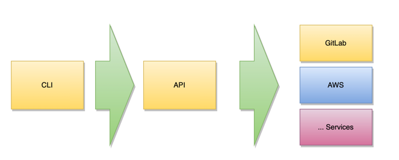

IskayPet Pets CLI.

* [Layers](#layers)
* [Source](#source)
  * [Python install](#python-install)
  * [Develop](#develop)
* [Redistributable](#redistributable)


## Layers



## Source

### Python install

```bash
brew install python
```

### Develop

In root folder

```bash
pip install pytest
pip install --editable .
```

## Redistributable

```bash
curl -o- https://raw.githubusercontent.com/arielsrv/pets-cli/v0.0.8/install.sh | bash
```

Usage

```bash
pets
```
